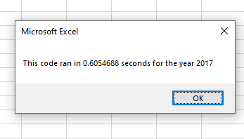
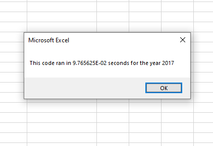

# Stock_Analysis
## Overview
The client is looking for a quick breakdown of the Stocks dataset that was gathered over the years 2017 and 2018. The results are displayed through a table that displays the Ticker, Total Daily Volume, and the Return for each specific year. With this table, the client will be able to see the success rate for each stock to be able to choose the right investment.  

## Results

###### Original vs Refactored.
Although the original code works as intended, there is always room to refactor the script to create a more efficient one. One of the purposes for this is to create faster runtimes. This is displayed when both codes are processed, and the runtimes are recorded. For example, using the 2017 stock market the average runtime before refactoring is about 0.6 seconds whereas the refactored script runs for 0.1 seconds or less (Please note that the refactored runtime is running below 0.1 seconds therefore it is displayed in scientific format).


 

 
## Summary

###### Advantages
While the script is optimized enough to be able to handle more features in the future if the client requests without penalizing the runtime. Another purpose is to be able to create a more organized and readable code for the developer now and others that might be working on it. Instead of accessing all the tickers array via a variable, ticker; a tickerindex is instead used to access it directly without having to set the value of the array inside a variable. Through this it is now easier to follow the script and by eliminating one more step, the code takes up less memory. Another advantage to this is by allowing the user to access and set the index, it is now possible to create more arrays to hold the totalVolumes, tickerStartingPrices and tickerEndingPrices. The result is a placeholder for all the data that the client needs and theoretically the same logic can be applied if the client needs more specific data pulled from the dataset; while all can be accessed through the index that is created.   

```
 Dim tickerIndex As Integer
    tickerIndex = 0
    
    'Create three output arrays
    Dim tickerVolumes(12) As Long
    Dim tickerStartingPrices(12) As Single
    Dim tickerEndingPrices(12) As Single
    
    
    'Create a for loop to initialize the tickerVolumes to zero.
    For i = 0 To 11
        
        tickerVolumes(i) = 0
    
    Next i
    'Loop over all the rows in the spreadsheet.
        For i = 2 To RowCount
    
        'Increase volume for current ticker
             tickerVolumes(tickerIndex) = tickerVolumes(tickerIndex) + Cells(i, 8).Value

        'Check if the current row is the first row with the selected tickerIndex.
            If Cells(i, 1).Value = tickers(tickerIndex) And Cells(i - 1, 1).Value <> tickers(tickerIndex) Then
                
                tickerStartingPrices(tickerIndex) = Cells(i, 6).Value
        
        'check if the current row is the last row with the selected ticker
        'If the next row’s ticker doesn’t match, increase the tickerIndex.
            ElseIf Cells(i, 1).Value = tickers(tickerIndex) And Cells(i + 1, 1).Value <> tickers(tickerIndex) Then
            
                tickerEndingPrices(tickerIndex) = Cells(i, 6).Value
         
         'Increase the tickerIndex.
                tickerIndex = tickerIndex + 1
            End If
         
    Next i
    
```

###### Disadvantages
While refactoring code might be a good idea, there are times that the original script is better left alone. For example, starting off with a broken code cannot be fixed by refactoring it. The whole point of refactoring is to create a better and more sustainable code to build on. When the original code works, refactoring it might introduce new bugs. With this, comes the last example; it is time consuming. Most of the time, there will not be enough time to go back and refactor the script before the initial deadline. Instead, it will be an ongoing process as more features are built and the code is optimized. This way, the developers can avoid code rot.
 
